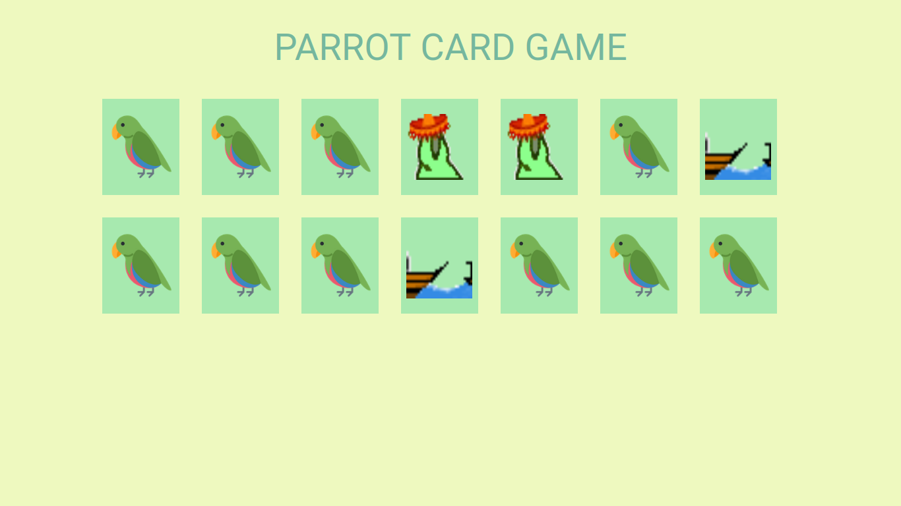

Bem-vindo ao Parrot Card Game! Este é um jogo da memória super divertido e envolvente, com gifs de papagaios dançantes, efeitos e transições.

O jogo foi desenvolvido utilizando as linguagens de marcação HTML, estilização CSS e programação JavaScript.

Este projeto foi criado durante a formação Full Stack da Driven, onde aprendi a desenvolver aplicativos e páginas web completas, do front-end ao back-end. Espero que você se divirta jogando!